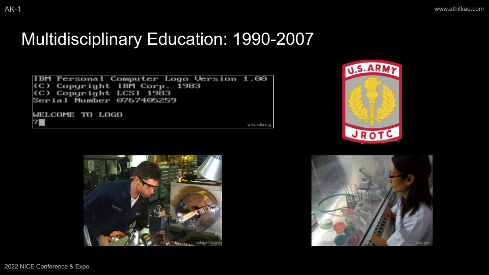
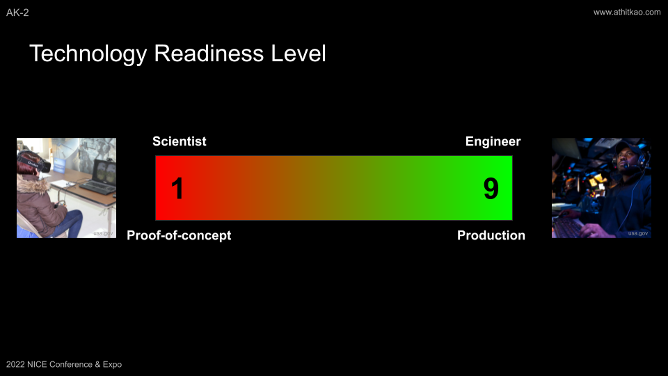
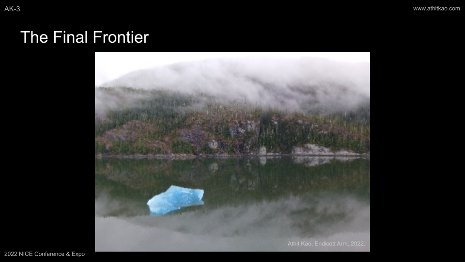
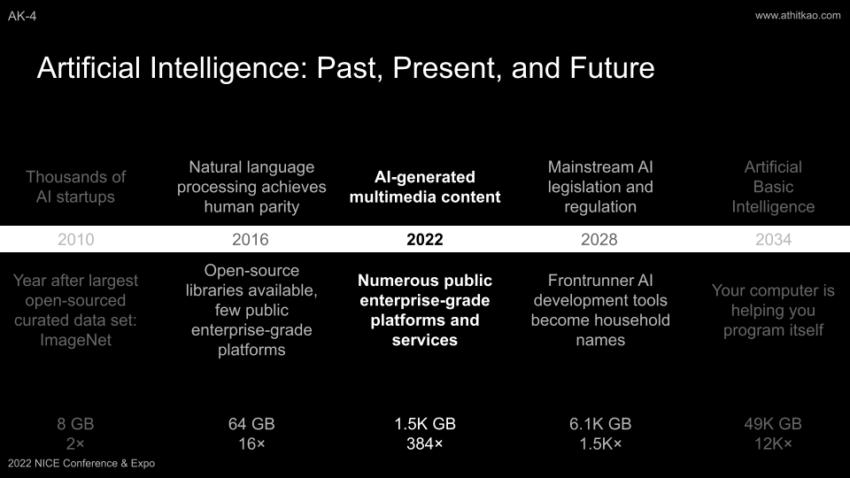
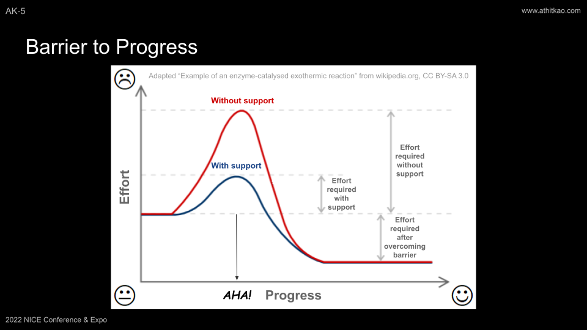

# [2022 NIST NICE Conference & Expo: Demystifying Cybersecurity](https://niceconference.org/)

### [June 6, 2022 (Pre-Conference Workshop): The Impact of Automation, Artificial Intelligence, Machine Learning, and Other Emerging Technologies on the Cybersecurity Workforce](https://niceconference.org/2022-conference/)

---

#### Speaker Notes for:

[Athit Kao, PhD](https://www.athitkao.com)  
Solutions and Business Development Lead for AI/ML  
[Raytheon Blackbird Technologies, Inc.](https://www.rtx.com/rbt)

---

---

---

---

---

---

Copyright © 2022-∞ Athit Kao, <a href="http://www.athitkao.com/tos.html" target="_blank">Terms and Conditions</a>
